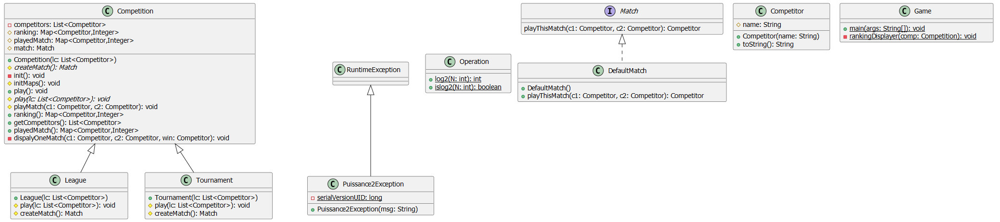
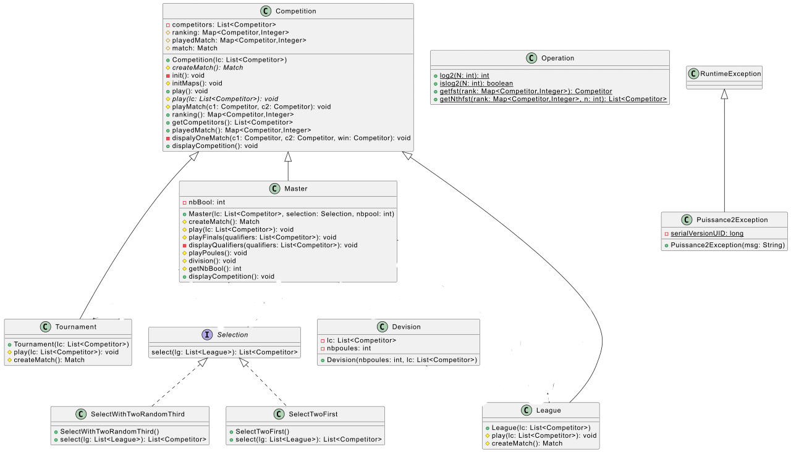
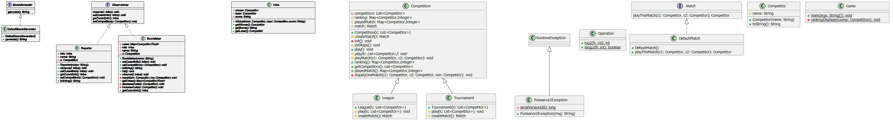

# projet-coo-2022-2023

# Binome :
- LAKROUT Hakim `hakim.lakrout.etu@univ-lille.fr`
- ZENAIDJI EL GHANI `elghani.zenaidji.etu@univ-lille.fr`

# Lien vers UML
[UML](https://lucid.app/lucidchart/f9e3abe2-fcd7-43ba-82d9-be197ad4c9e9/edit?viewport_loc=792%2C44%2C1405%2C691%2CHWEp-vi-RSFO&invitationId=inv_6e6e1a36-5f3b-4011-b125-a6e50f5c7fa3#)
# diagramme uml finale  de  src

# Introduction
# Competition V1

 notre première  version (v1) du projet  permet l'organisation d'une compétition sportive durant laquelle les compétiteurs s'affrontent entre eux;
 la compétition peut se dérouler sous forme d'un tournoi(Tournament) à élimination directe vainqueur est le compétiteur ayant gagné tous ses matchs) ou sous forme d'un championnat (Ligue) qui se joue en match aller-retour ou le vainqueur est donc le compétiteur ayant
cumulé le plus grand nombre de victoires.

# Correction de la V1
- Correction des erreurs lors de la génération de la javadoc
- ajout des vainqueurs  dans play de tournament (supression de la boucle for)     
- varier les arguments en ligne de commandes
# Competition V2

dans cette version (V2)  de  notre Compétition(Master) nous allons la dérouler en deux étapes.
la première étape est la phase de poules, dans cette phase se fera la réparttion des équipes en poules (groupes) , après ça les membres de chaque poule va s'affronter dans un chompionat.

la deuxième étape est la phase à élimination directe les qualifiers (sélectionnés) pour cette phase vont s'affronter entre eux dans un tournoi et le compétiteur ayant plus de points est le vainqueur du master.

# Competition V3
dans notre version (V3) de la compétition Des journalistes peuvent donc assister aux compétitions et diffuser les résultats des matchs.
 Les bookmakers, quant à eux, font évoluer les cotes des compétiteurs.

# HowTo
* Récupération du dépôt `git clone git@gitlab-etu.fil.univ-lille.fr:hakim.lakrout.etu/projet-coo-2022-2023.git`
* géneration de la documentation`javadoc -sourcepath src -d docs -subpackages competition game competitor matchs util competition.division competition.selection competition.observers competition.score competition.infos `
* compilation  `javac -sourcepath src -d classes src/*/*.java` ou  `make classes`  
* éxecution `java -classpath classes game.Game 16` ou n est le nombre de competiteurs 
* compilation des test 
   - `javac -sourcepath src -d classes test/competition/MockSelection.java `
   - `javac -sourcepath src -d classes test/competition/observers/MookObserver.java `
   - `javac -cp classes:junit-platform-console-standalone-1.9.1.jar -d classes test/*/*.java`
   - `javac -cp classes:junit-platform-console-standalone-1.9.1.jar -d classes test/*/*/*.java `

* éxecution des test `java -jar junit-platform-console-standalone-1.9.1.jar  -cp classes --scan-class-path`
* génération de l’archive du projet après compilation: `jar cvfe game.jar game.Game -C classes .`
* éxecution de l’archive avec un nombre de compétiteurs en argument `java -jar game.jar 8 ` 
* dans le dossier racine du projet nous avons inclus un fichier Makefile qui permet de lancer toute les commandes prcédentes pour cela il suffit de lancer `make`

# Présentation des principes de conception mis en œuvre
- Test-Driven Development en commançant par l'ecriture des tests
- le polymorphisme avec nos différents types de Compétitions et de matchs
- OCP la structure de notre projet permet l'ajout de différents types de compétition avec différents types de matchs 
- SRP chaque classe a une unique responsabilité 
- la méthode factory dans nos tests qui permet de faire varier les instances créer dans notre cas les instances "Tournament" et "Ligue"
- "KISS" en simplifiant notre le code de nos classes 
- "DRY" en appelant du code déjà existant dans nos classe pour éviter des duplications de code    
- le principe "YAGNI"
- Design pattern `Strategy` pour le choix de la sélection entre la classe master et le type Selection

# Retour Sur la V2 :
Pour ajouter des nouvelle strategy de selection ou aussi de devision de groupe dans le master il suffit seulement de creer les classe correspendante toute en implementant de Selection pour les strategies de selection ou en heritant de la classe divion pour les technique de division de groupe et cette ajout que nous pouvons qualifier de dynamique est du au design pattern Strategy mis en oeuvre dans le Master .
# V3

- mise en oeuvre du design pattern Observer fourni en annexe pour les journaliste et les bookmaker quis suiveronts tout les match d'une competition . 
- gestion et génération du score de chaque match
- ajout d'un type Observercmp pour les observers
- création du type information que regroupe les informations de chaque match.
- la methode observe(Infos i) notifie l'observateur à la fin de chaque match.
- notre conception permet l'ajout de déffirents bookmakers avec déffirentes formules de calcules des cotes.
- choix du nombre d'observers dans notre main.

 

